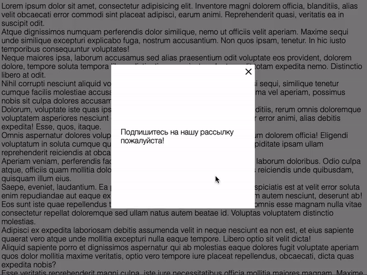

# Всплывающее окно

Домашнее задание к занятию 3.2 «Хранение состояния на клиенте».

## Описание 

Необходимо реализовать всплывающее окно, которое появляется только один раз. 
То есть, только после закрытия этого окна (а не просто обновления страницы), 
оно больше никогда не покажется.



[Ранее](../../element-search/popups) вы уже выполняли работу со всплывающими окнами, это домашнее задание
использует похожие стили и разметку. Вы можете взять за основу ваш прошлый код.

### Исходные данные

1. Основная HTML-разметка
2. Базовая CSS-разметка

Базовая разметка окна представлена в виде:

```html
<div class="modal" id="subscribe-modal">
    <div class="modal__content">
        <div class="modal__close modal__close_times">&times;</div>
        Подпишитесь на нашу рассылку пожалуйста!
    </div>
</div>
```

При нажатии на элемент с классом *modal__close* необходимо закрыть окно.
Закрыть окно - значит удалить у него класс *modal_active*.

Открытое окно имеет следующую разметку:

```html
<div class="modal modal_active" id="subscribe-modal">
    <!-- ... -->
</div>
```

### Процесс реализации

1. После закрытия окна, установите в cookie-файле информацию о закрытии окна
2. Если после перезагрузки в cookie нет информации о закрытии, необходимо 
окно показать.
3. Если страница была перезагружена с показанным окном, в cookie-файл не нужно
ничего вносить
